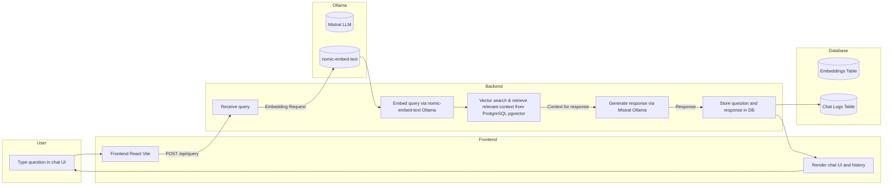

# Full-stack AI Chat System - Docker + Ollama + pgvector

## 📚 Overview

This system allows users to ask natural language questions and receive intelligent answers generated by an **LLM (Ollama)**.  
By leveraging **Retrieval-Augmented Generation (RAG)**, it retrieves context from your own **knowledge base** stored in PostgreSQL with **pgvector**, enabling accurate and customized responses based on your data.

---
## ✅ Features
- **Minimal, ChatGPT-like UI** — simple and intuitive chat interface  
- **Chat history display** — messages are shown from oldest to newest  
- **Seamless backend integration** — communicates via `/api/query` and `/api/getchatlog`  
- **LLM powered by Mistral (via Ollama)**  
- **RAG pipeline implemented with LangChain** — retrieves relevant information from a PostgreSQL + pgvector knowledge base before generating responses  
- **Custom knowledge base support** — easily store and search your own documents or internal data for context-aware answers  

>  **Ollama** is a lightweight framework that lets you run large language models (LLMs) locally on your own computer — without relying on cloud APIs like OpenAI’s.

---
## 🚀 Tech Stack

- **Frontend:** React (TypeScript + Vite) 
- **Backend:** Express.js (TypeScript)
- **LLM Integration:** LangChain + Mistral (via [Ollama](https://ollama.com/))
- **RAG:** Generate and store embeddings with `nomic-embed-text`, retrieve relevant documents using pgvector, and build context prompts for the LLM
- **Database:** PostgreSQL (pgvector)
- **Containerization:** Docker, Docker Compose

---

## 💬 How It Works
### User Interaction Flow
1. The user types a question in the chat input on the frontend.  
2. The frontend sends a POST request to **`/api/query`**.  
3. The backend processes the request using **LangChain**:  
   - The question is **embedded** using the embedding model (`nomic-embed-text` via Ollama).  
   - A **vector similarity search** is performed in PostgreSQL (pgvector) to find the most relevant context.  
   - The retrieved context is **combined** with the user’s query and sent to the **LLM (Mistral via Ollama)** for response generation.  
4. The generated response is returned to the frontend **and saved in the database** for chat history tracking.  
5. A GET request to **`/api/getchatlog`** retrieves all previous chat logs for display in the UI.

### Under the Hood
- **RAG (Retrieval-Augmented Generation)** implemented with **LangChain**  
- **LLM-powered responses** using **Mistral** via **Ollama** (runs locally, no external APIs required)  
- **PostgreSQL + pgvector** for document embeddings and similarity search  
- **Persistent chat history** with unique IDs and timestamps  
- **Frontend rendering** displays messages chronologically (oldest → newest)


## 🧠 System Architecture Diagram



---

## ⚙️ Project Setup Instructions

1. Clone the Repository
```bash
git clone https://github.com/miwgu/Chat-with-AI-Using-RAG.git
```
2. Install Dependencies both frontend and backend
```bash
npm install
``` 
---

## 🌍Enviroment file

- Add a .env file in the project root
- change settings for Docker or Local
```bash
#PORT=3000
# FRONTEND_ORIGIN=http://localhost:5173

# Database local settings
#DB_HOST=172.17.112.1
#DB_USER=****
#DB_PASSWORD=****         
#DB_NAME=ai_chat_db2025   
#DB_PORT=3306             


PORT=3000
FRONTEND_ORIGIN=http://localhost:4173
OLLAMA_URL=http://host.docker.internal:11434
OLLAMA_MODEL=mistral
VITE_BACKEND_URL=http://localhost:3000

# Database Docker
DB_HOST=postgres
DB_PORT=5432
DB_USER=myuser
DB_PASSWORD=mypassword
DB_NAME=chatdb

```
-for Frontend
```bash
#local
#VITE_BACKEND_URL=http://localhost:3000
#Docker
VITE_BACKEND_URL=http://localhost:3001
```


---
## 🧠 Ollama Setup (Required before running Docker)

Before starting the Docker containers, you need to install and set up **Ollama** on your local machine.  
The backend container connects to Ollama running on your host machine via `http://host.docker.internal:11434`.

   
1. Install Ollama
- For Windows (WSL2 + Ubuntu)  
- For Mac (Intel/Apple Silicon)
```bash
curl -fsSL https://ollama.com/install.sh | sh
```

2. Download LLM Model (e.g., Mistral)
```bash
ollama run mistral
```

3. Download Embed Model (e.g., nomic-embed-text)
```bash
ollama run nomic-embed-text
```

4. Optional: If using a different model, update the model name in ollama.ts.

5. Start Docker
---

## 🐳Docker Container Setup 

1. Start Containers
```bash
docker compose up -d --build
```
2. Register Knowledge (Initial Setup)
> This step is required only once when the database is empty or the persistent volume has been removed.
```bash
docker compose exec aida-backend npx ts-node src/rag/registerKnowledge.ts
```
3. Stop and Remove Containers (Optional)
```bash
docker compose down
```
>⚠️ Note: The knowledge embeddings are stored in a persistent PostgreSQL volume.
You do not need to re-run the registration script unless the database or volume is deleted.
---

## 💾 Database Setup with init.sql
You don’t need to do anything manually to set up the database `chatdb`.  
It is automatically created by `docker-compose.yml`.

The `postgres_data` volume is **persistent**, which means that even if you delete the container, the volume (and thus the database data) will remain. This is why the database may continue to operate with old data.

```yaml
environment:
  - POSTGRES_DB=${DB_NAME}
  - POSTGRES_USER=${DB_USER}
  - POSTGRES_PASSWORD=${DB_PASSWORD}
volumes:
  - ./init.sql:/docker-entrypoint-initdb.d/init.sql
```
---

## 🔄 Resetting the Database

If you want to completely delete chatdb and create a new one:
```bash
docker compose down -v && docker compose up -d
```
This will remove both the container and the persistent volume, so the database is recreated from scratch.

---

## 📝 Accessing the Database
Login to the Postgres container (you will need to enter the password):
```bash
docker exec -it aida-postgres-container psql -U myuser -d chatdb
```
Check existing tables:
```bash
\dt  
```


---

## 📈 API Endpoints

| Method | Endpoint        | Description                  | Request Body                    | Response Example                  |
|--------|-----------------|------------------------------|--------------------------------|----------------------------------|
| POST   | /api/query      | Send a question to the LLM   | `{ "question": "string" }`      | `{ "response": "string" }`        |
| GET    | /api/getchatlog | Retrieve all chat history    | None                           | `[ { "id": "uuid", "question": "string", "response": "string", "created_at": "timestamp" }, ... ]` |

---

## 📝 Future Improvements 

- Add user authentication (JWT)
- Delete history entries by ID
- Create and group chat sessions by topic
- Add search functionality in chat logs

